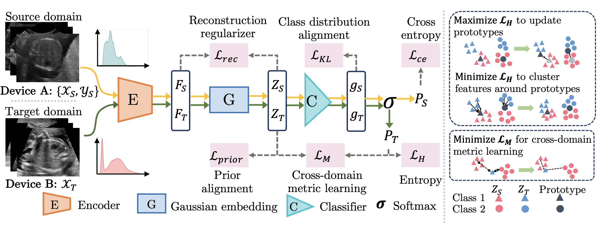

# MetFA
Code for paper ''Unsupervised Cross-domain Image Classificationby Distance Metric Guided Feature Alignment''

<p align="center">
    
</p>


If you make use of the code, please cite the paper in any resulting publications.


```
@article{mengMetFA,
  title={Unsupervised Cross-domain Image Classificationby Distance Metric Guided Feature Alignment},
  author={Meng, Qingjie and Rueckert, Daniel and Kainz, Bernhard},
  volume ={arXiv:2008.08433},
  journal = {CoRR},
  year={2020}
}
```


This code (residual_modef.py) uses the residual unit from toolkit DLTK (https://dltk.github.io/). Please install the DLTK before using residual_modef.py
